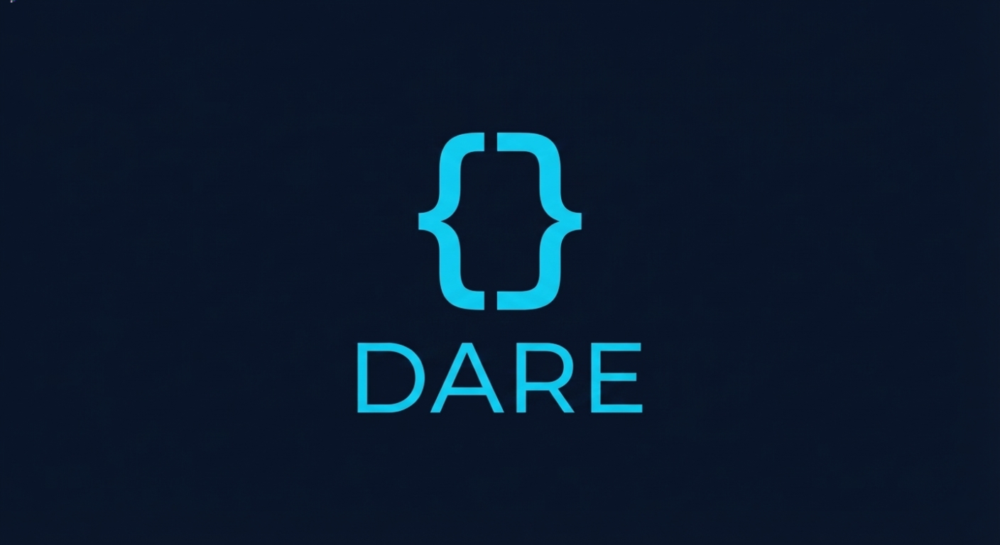

  

  
  
  

# DARE — The Language for AI Documents

**Stop forcing LLMs to write HTML.** DARE is a deterministic, token-efficient markup language designed specifically for the AI era. It generates pixel-perfect PDF documents from simple, structured prompts while using up to **10x fewer tokens** than traditional HTML/CSS workflows.

---

## Why DARE?

HTML was designed for the fluid, responsive web—not for static, rigid PDF documents. When AI agents generate documents using HTML, they encounter:
- **Token Inefficiency:** HTML/CSS boilerplate consumes vast amounts of context window.
- **Rendering Instability:** Tiny CSS mistakes lead to layout breaks and page-overflow nightmares.
- **Non-Deterministic Layouts:** The same HTML can look different depending on the rendering engine.

**DARE** solves this by rebuilding the document workflow from the ground up:
1. **Token Economy:** A syntax so compact that a full professional invoice fits in a single tweet.
2. **Deterministic Layout:** A box defined as `h=50mm` is always 50mm. No cascading conflicts.
3. **AI-Native Construction:** Built with 16 core components that LLMs understand intuitively.

---

## The Vision: V2.0 Professional Engine

With the release of **DARE v2**, we have moved beyond a simple parser to a full **Professional Document Engine**.
- **Modular Architecture:** A robust tokenizer and component registry.
- **Advanced Layout Engine:** Native support for 40+ CSS shorthands (px, py, mx, my, r, ta, lh, pos, ...).
- **Pro Components:** Built-in support for SVG Charts (Bar/Pie), QR Codes, Tables, and Multi-column grids.
- **Lightning Fast:** Real-time preview and sub-second PDF generation via Puppeteer.

---

## Documentation & Learning

To keep this repository clean, all technical guides, API references, and benchmarks have been moved to our documentation site:

👉 **[Official DARE Documentation & Benchmarks](https://dare.pages.dev/)**

For the latest AI System Prompt, refer to **[SYSTEM_PROMPT.md](./SYSTEM_PROMPT.md)**.

---

## Contributing & Support

DARE is an open-source project aimed at making automated document generation accessible and efficient.

If you find DARE useful, consider supporting its development:
**USDT (TON Network):** `UQBEJwLa4EGPRmUKw4O1i9d_JjJGmjkJ2myqR5lborzgceT-`

---

## Author
**DARE** is designed and built by **Hassan Elkady**.

* **GitHub:** [local-over](https://github.com/local-over)

## License
Licensed under the **MIT License**.
